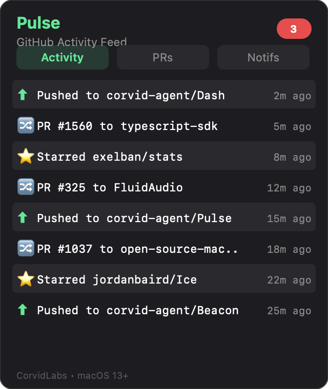

# Pulse

A macOS menu bar app for viewing GitHub activity at a glance.



## Features

- **Recent Activity** -- Last 10 GitHub events (pushes, PRs, issues, stars)
- **PR Status** -- Open PRs across your repos
- **Notifications** -- Unread GitHub notifications with badge count
- **Quick Links** -- Open repos, PRs, issues in browser

## Requirements

- macOS 13+
- Swift 6.0
- GitHub CLI (`gh`) authenticated via `gh auth login`

## Build & Run

```bash
swift build
swift run Pulse
```

## Run Tests

```bash
swift run PulseTests
```

## Architecture

- `PulseApp.swift` -- App entry point with `MenuBarExtra`
- `PulseView.swift` -- Main container with tab navigation
- `ActivityView.swift` -- GitHub events list
- `PRStatusView.swift` -- Open pull requests
- `NotificationsView.swift` -- Notification list
- `GitHubService.swift` -- Actor-based API client
- `Models.swift` -- Codable structs for GitHub API
- `Theme.swift` -- Colors, fonts, styling constants
